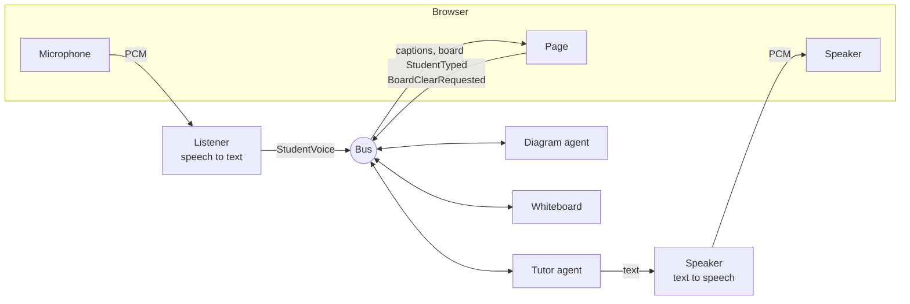
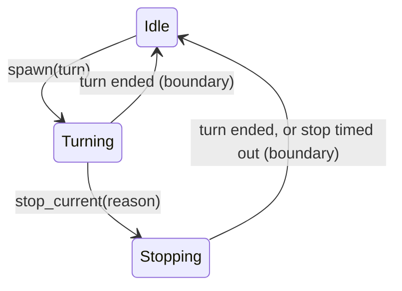

# How it fits together

## The big picture

There are three services, and two of them are agents. The **tutor** talks
with the student. The **diagram agent** draws diagrams when the tutor asks for
one. The **whiteboard** keeps track of what is on the board. They never call
each other. Each one publishes messages on a shared bus and receives the
messages it has subscribed to.

The voice edge sits around them. Microphone audio from the browser is turned
into "the student is saying this" messages on the bus. The tutor's replies are
turned into speech and played in the browser.



## Folders, and what may import what

| Folder | Holds | May import |
| --- | --- | --- |
| `events/` | The bus and every message type | the standard library only |
| `providers/` | One adapter per vendor, and the shared types each kind of vendor speaks | vendor SDKs and `events/` |
| `packages/` | Reusable plumbing with no decisions of its own (the voice pieces) | `events/`, `providers/` |
| `services/` | The agents and the whiteboard, and the loop the agents share | `events/`, `packages/`, provider base types |
| `apps/` | The entry point that wires everything together | everything |

A few more rules hold the separation together:

- Services use a provider's base types (`providers/llm/base.py` and so on),
  never a vendor module. The tutor asks for "a chat model that can call
  tools", not for Anthropic.
- Only `apps/voice_tutor/compose.py` picks vendors and builds them, and only
  `apps/voice_tutor/config.py` reads the environment.
- Services don't import each other. They talk over the bus.

`uv run lint-imports` checks these rules, and the test suite runs it. The
contracts are at the bottom of `pyproject.toml`.

## The bus

Every message is a frozen dataclass declared as a topic, with the one owner
allowed to publish it and the owners allowed to consume it:

```python
@topic(publisher="tutor", consumers=("diagrammer", "whiteboard"))
@dataclass(frozen=True)
class DiagramRequested:
    request_id: str
    description: str
```

Publishing as the wrong owner, or subscribing as an owner that isn't listed,
raises an error. Publishing is synchronous, and every subscriber sees messages
in one global order. A message published while another is still being
delivered waits until that delivery finishes.

| Topic | Published by | Consumed by |
| --- | --- | --- |
| `StudentVoice` (started, interim, final) | room (the voice edge) | tutor, ui |
| `StudentTyped` | ui | tutor |
| `BoardClearRequested` | ui | whiteboard |
| `DiagramRequested` | tutor | diagrammer, whiteboard |
| `DiagramFinished` | diagrammer | whiteboard, tutor |
| `BoardChanged` | whiteboard | tutor, ui |
| `TutorSpeech` (captions) | tutor | ui |

## The agent loop

Both agents run on the same small loop, in `services/shared/runtime/`. It is
what lets an agent be interrupted at any moment without getting confused.

**One inbox.** Everything that happens to an agent arrives as a message in
its inbox. The loop takes one message at a time, in order, and asks the
agent's **policy** for a verdict: what this message should do, given what is
happening right now. Verdicts never wait on anything, so a decision is a plain
function you can read top to bottom.

**One turn slot.** A **turn** is one piece of work, such as one reply. At most
one turn runs at a time, as its own task, and only the policy starts one, with
`spawn`, when the loop is idle.

**Any turn can be stopped.** `stop_current` asks the running turn to wrap up
and keep what it has. If the turn hasn't ended within a few seconds, the loop
cancels it and moves on without it.

**The boundary.** When a turn ends, for any reason, the loop frees the slot
and calls the policy's `boundary`. That is where the policy records the turn's
result and decides what runs next. A turn has always fully ended before the
next one starts.

**The fence.** Each turn gets a fence, and the loop closes it when the turn
ends. A model stream or tool call that outlives its turn checks the fence
before it speaks, publishes, or records anything, so it can't.



## The tutor

The tutor's policy (`services/tutor/policy.py`) keeps track of:

- **The conversation.** Only the boundary adds to it.
- **Whether the student is talking.** This starts with the first transcribed
  words of an utterance and ends with its final transcript.
- **Words waiting for a reply.** These are the student's words that arrived
  while a reply couldn't start yet. They all go into the next reply.
- **Riders.** These are private notes that ride along with whichever turn
  starts next, once. When the student clears the board, the tutor learns
  about it this way.

A tutor turn (`services/tutor/turn.py`) streams the model's reply straight
into speech, a sentence at a time. If the model calls a tool, the turn runs
it and calls the model again with the result. `draw_diagram` publishes a
`DiagramRequested` and returns immediately, because drawing happens elsewhere
and takes a while.

A stop cuts the speech off at once and cancels the model call. Either way,
the turn ends by cutting its reply down to what the student actually heard,
so the conversation never claims the student heard words they didn't. Tool
calls that already ran are kept.

## Voice

**Listening** (`packages/voice/listener.py`). Microphone audio streams to
ElevenLabs speech-to-text. That service sends partial transcripts while the
student talks and a committed transcript after half a second of silence. The
first partial with words becomes `StudentVoice(started)`, later partials
become `interim`, and the committed transcript becomes `final`.

**Speaking** (`packages/voice/speaker.py`). The tutor's text is split into
sentences. Each sentence is synthesized as soon as it is complete and queued
for playback. The browser reports how many samples it has actually played.
After an interrupt, the heard text is every sentence that played in full,
plus the share of words of the sentence that was cut off. The same accounting
runs while the speech plays, and the page's captions follow it, so a caption
shows a word once it has been spoken.

**The browser connection** (`packages/voice/browser_audio.py` and
`packages/voice/static/`). One websocket carries microphone audio up and
speaker audio down, along with playback reports. When no tab has voice on,
the tutor's speech plays on a simulated clock, so its turns still take as
long as they would out loud.

## The diagram agent and the whiteboard

The diagram agent (`services/diagrammer/`) draws one diagram at a time, in
the order requested. It asks its model for a title and a Mermaid diagram and
publishes the outcome as `DiagramFinished`.

The whiteboard (`services/whiteboard/`) is not an agent. It holds the items
on the board: a "drawing…" card as soon as a diagram is requested, which
becomes the diagram or an error when it finishes. Every change is published
as `BoardChanged` with a new revision.

## Fakes and tests

`providers/testing/` holds fakes for each kind of provider: a scripted chat
model, silent speech, and a recognizer that "hears" a fixed sentence. It also
holds one contract suite per kind. The same checks run against the fakes on
every test run, and against the real vendors with `uv run pytest -m live`.
Everything above the providers is tested with the fakes.
